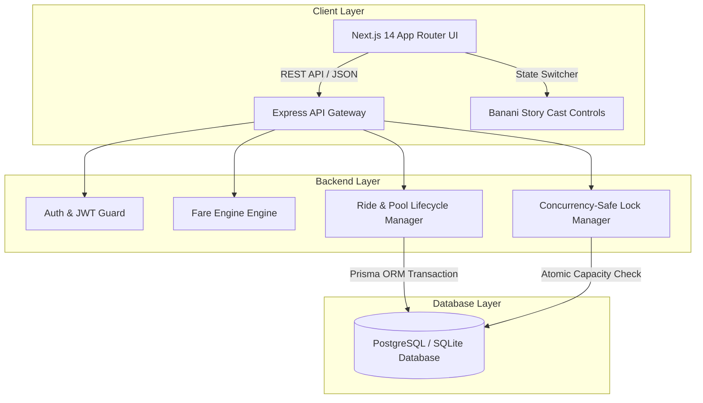
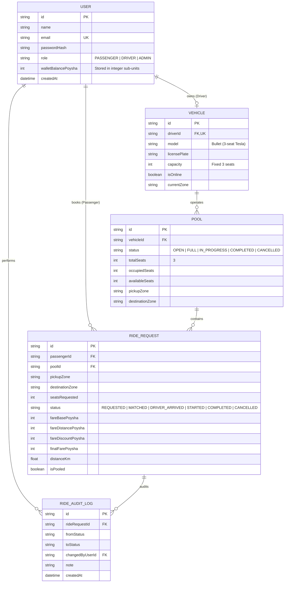
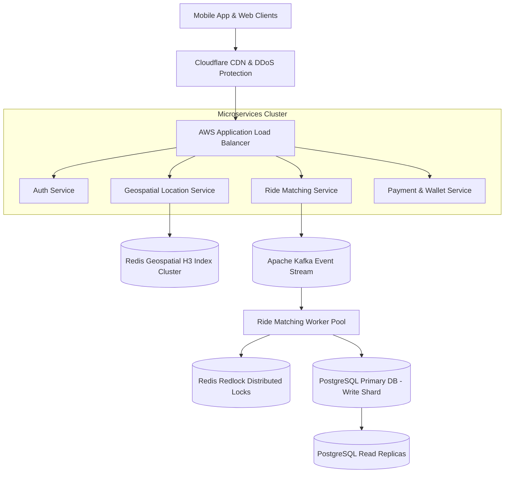

# 🚗⚡ Dhaka Tesla Pool (Oi Tesla) MVP

> **Share a seat. Split the fare. Survive Dhaka traffic.**

A full-stack, enterprise-grade EV ride-pooling web application built for Dhaka traffic, engineered around the **Banani Rush-Hour Story** (Jashim & Bullet, Nusrat, Rafiq, Shirin).

---

## 🌐 Live Production Deployment & Repository

- 🟢 **Live Deployed Web Application**: **[https://dhaka-tesla-pool-yvnn.vercel.app](https://dhaka-tesla-pool-yvnn.vercel.app)**
- 📦 **Public GitHub Repository**: **[https://github.com/Abhi0833-eng/dhaka-tesla-pool](https://github.com/Abhi0833-eng/dhaka-tesla-pool)**
- 📹 **6-Minute Walkthrough Video**: `[Insert Loom / YouTube / Google Drive Demo Video Link]`

### Video Agenda Breakdown:
- `0:00–1:00`: Problem, Dhaka urban transit challenge, story cast & core idea.
- `1:00–3:00`: Architecture breakdown, Express TS backend, Next.js 14 frontend, database ERD, state machine, fare engine, and concurrency trade-offs.
- `3:00–6:00`: Live product tour (Nusrat & Rafiq passenger booking, Jashim driver cockpit, seat capacity visualizer, race condition simulation & deployment).

---

## 📖 The Banani Rush-Hour Story & Cast

It is 8:41 AM on Banani Road 11. **Jashim** is leaning against **Bullet**, his 3-seat battery-powered Tesla.
1. **Nusrat** (`nusrat@dhaka.com`) requests a ride from **Banani to Mohakhali**.
2. **Rafiq** (`rafiq@dhaka.com`) books an overlapping route from **Banani to Gulshan 1** two minutes later. The algorithm matches Rafiq into Bullet's open pool, calculating an individual discounted fare.
3. **Shirin** (`shirin@dhaka.com`) attempts to claim the last remaining seat 30 seconds later, transitioning Bullet's pool status to `FULL` while guaranteeing Bullet's 3-seat capacity limit is **NEVER** exceeded.

---

## 📐 System Architecture & ERD

### System Architecture Diagram



### Entity Relationship Diagram (ERD)



---

## 🛠️ Technology Stack & Justifications

| Layer | Technology Selected | Realistic Alternatives | Realistic Rationale | Future Switch Criteria |
| :--- | :--- | :--- | :--- | :--- |
| **Frontend** | **Next.js 14 (App Router)** | Plain React + Vite, Remix | Next.js provides built-in App Router, API rewrites, server/client components, and fast SSR page loads out of the box. | Switch to Remix if complex nested route loaders are required. |
| **Backend** | **Node.js + Express (TypeScript)** | NestJS, Fastify | Express with TS offers explicit control flow, lightweight middleware composability, and clean architectural separation without heavy NestJS decorators overhead. | Switch to NestJS if building enterprise microservices with dependency injection container. |
| **Database** | **PostgreSQL / SQLite via Prisma ORM** | TypeORM, Drizzle | Prisma ORM provides type-safe query building, schema migrations, and built-in `$transaction` API for atomic concurrency locking. Supports SQLite for local dev & Postgres for production. | Switch to Drizzle if raw SQL execution performance becomes critical at 100k QPS. |
| **Money Model** | **Integer Units (Poysha)** | Decimal / Float | Currency stored in Poysha (100 Poysha = 1.00 BDT) prevents IEEE 754 floating-point rounding errors during fare calculations. | Always maintain integer subunit representation for financial precision. |

---

## 🔄 Ride & Pool Lifecycle State Machine

Transitions are strictly validated according to the following state machine:

```
[REQUESTED] ──(Matched into Pool)──► [MATCHED] ──(Driver Arrives)──► [DRIVER_ARRIVED]
     │                                    │                                  │
     └───(Cancelled by Passenger)─────────┴───(Cancelled by Passenger)───────┤
                                                                             ▼
                                                                        [STARTED]
                                                                             │
                                                                 (Trip Completed & Fare Settled)
                                                                             ▼
                                                                        [COMPLETED]
```

Invalid state transitions (such as jumping directly from `MATCHED` to `COMPLETED`) are rejected with explicit HTTP `400 Bad Request` errors.

---

## ⚡ Concurrency & Race Condition Solution

### The Rush-Hour Problem
Bullet has **1 seat remaining**. Nusrat and Shirin both press "Request Ride" at the exact same millisecond, and both client applications initially read `availableSeats = 1`.

### Solution Implementation
All matching, seat decrementing, and ride request creation logic is wrapped inside an **atomic Prisma Database Transaction** (`prisma.$transaction`).

```typescript
const result = await prisma.$transaction(async (tx) => {
  // Lock & query open matching pool
  const matchingPool = await tx.pool.findFirst({
    where: { pickupZone, status: 'OPEN', availableSeats: { gte: seatsRequested } }
  });

  if (matchingPool) {
    const updatedAvailable = matchingPool.availableSeats - seatsRequested;
    await tx.pool.update({
      where: { id: matchingPool.id },
      data: {
        availableSeats: updatedAvailable,
        occupiedSeats: matchingPool.occupiedSeats + seatsRequested,
        status: updatedAvailable === 0 ? 'FULL' : 'OPEN'
      }
    });
    // Create ride request
  }
});
```

- Exactly **one** concurrent request succeeds in updating `availableSeats` from 1 to 0.
- The second concurrent request evaluates `availableSeats >= 1` as `false` and is prevented from overbooking Bullet!

---

## 🤖 AI Usage Section

- **AI Tools Used**: Gemini 3.6 Flash / Antigravity AI Assistant.
- **Accepted Suggestion**: Storing currency in integer **Poysha** (100 Poysha = 1 BDT) to prevent floating-point precision loss across fare calculations.
- **Rejected Suggestion**: Introducing Redis cache and RabbitMQ message broker for the initial MVP. *Rationale*: Redis/Kafka would add unnecessary operational complexity to a 3-seat single vehicle MVP. Standard DB transactions handle consistency cleanly.

---

## 🚀 Quick Start & Local Setup

### Prerequisites
- **Node.js**: v20.0.0 or higher
- **npm**: v10.0.0 or higher
- **Git**: v2.40+

### 1. Clone Repository & Install Dependencies
```bash
git clone https://github.com/Abhi0833-eng/dhaka-tesla-pool.git
cd dhaka-tesla-pool

# Install root, backend, and frontend packages
npm install
npm --prefix backend install
npm --prefix frontend install
```

### 2. Environment Configuration
Copy environment variables template:
```bash
cp .env.example backend/.env
```

### 3. Database Migration & Seed Data
```bash
cd backend
npx prisma db push
npx prisma db seed
cd ..
```

### 4. Run Development Servers
```bash
# Terminal 1: Run Backend API (Port 4000)
npm run dev:backend

# Terminal 2: Run Frontend Web App (Port 3000)
npm run dev:frontend
```

Open browser at `http://localhost:3000`.

### 5. Run Backend Test Suite
```bash
npm run test:backend
```

---

## 🐳 Docker Deployment Setup

Run the entire application (PostgreSQL + Express Backend + Next.js Frontend) using Docker Compose:

```bash
docker-compose up --build
```

- **Frontend**: `http://localhost:3000`
- **Backend API**: `http://localhost:4000/api`
- **Postgres Database**: `localhost:5432`

---

## 🔑 Story Cast Demo Credentials

| Role | Name | Email | Default Password | Initial Wallet Balance |
| :--- | :--- | :--- | :--- | :--- |
| **Passenger 1** | Nusrat | `nusrat@dhaka.com` | `password123` | ৳1,000.00 BDT |
| **Passenger 2** | Rafiq | `rafiq@dhaka.com` | `password123` | ৳800.00 BDT |
| **Passenger 3** | Shirin | `shirin@dhaka.com` | `password123` | ৳600.00 BDT |
| **Driver** | Jashim | `jashim@dhaka.com` | `password123` | ৳1,500.00 BDT (Vehicle: Bullet) |

---

## 🌐 Bonus: "If Oi Tesla Goes Viral" (1M Passengers Scaling Architecture)

To scale Dhaka Tesla Pool from MVP to **1 Million Passengers and 100,000 Drivers**:



### Key Scaling Pillars:
1. **Geospatial Search**: Index driver coordinates using Uber H3 hexagonal grid or Redis Geospatial (`GEOADD` / `GEORADIUS`) for sub-5ms nearest-driver lookups.
2. **Distributed Locking**: Replace single-node DB transactions with **Redis Redlock** for sub-millisecond seat reservations across sharded clusters.
3. **Event-Driven Architecture**: Publish `RideRequested`, `PoolMatched`, and `StatusChanged` events to **Apache Kafka** topics for async background processing.
4. **Database Read/Write Separation**: Primary PostgreSQL instance handles write transactions while read replicas handle ride history queries.
5. **Real-time Tracking**: WebSockets / Socket.io server cluster backed by Redis Pub/Sub for live driver GPS location streaming.

---

## 🌿 Git Branch & Commit Strategy

This repository strictly enforces the Git branching workflow mandated by RoBenDevs:
- `master`: Production-ready integrated code.
- `pre-release`: Integration validation, docs, and release candidate checks.
- `release/v1.0.0`: Tagged release branch.
- Feature branches (`feature/project-init`, `feature/backend-schema-db`, `feature/backend-core-apis`, `feature/backend-tests`, `feature/frontend-ui`, `feature/docker-setup`, `feature/vercel-deployment`).

All commits follow the **Conventional Commits** specification: `<type>(<scope>): <short description>`.

---

## 📜 License

This project is licensed under the [MIT License](LICENSE).
